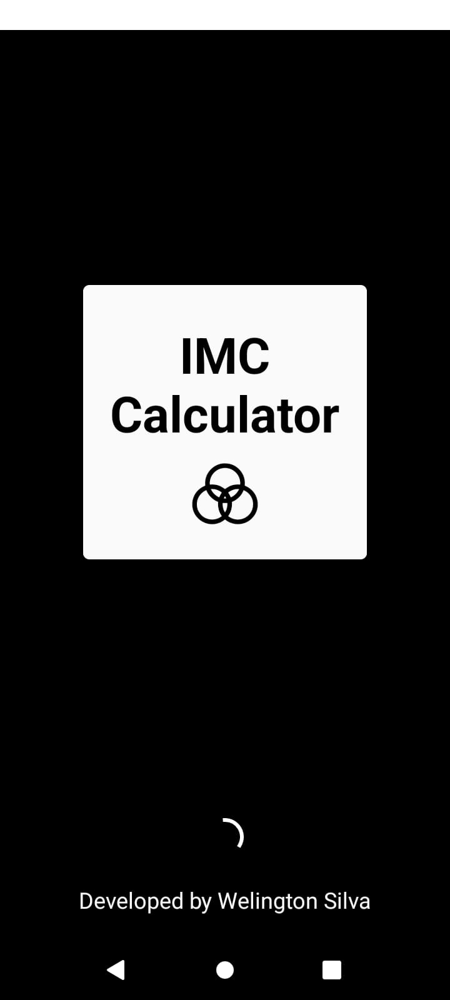

# IMC Calculator

## Descrição

O **IMC Calculator** é um aplicativo desenvolvido para ajudar os usuários a calcular seu Índice de Massa Corporal (IMC) e fornecer dicas de vida saudável. O aplicativo apresenta uma breve explicação sobre o IMC e como ele é calculado, além de uma interface para realizar os cálculos e acessar dicas úteis.

## Funcionalidades

- Calcular o IMC.

- Compartilhar o resultado com o link do APK.

## Tecnologias e Bibliotecas Utilizadas

- **React Native**: Para o desenvolvimento da interface do usuário.

- **Expo**: Para facilitar o desenvolvimento e teste do aplicativo.

- **React Navigation**: Para a navegação entre as diferentes telas do aplicativo.

- **React Native Vector Icons**: Para os ícones utilizados na interface.

- **React Native Gesture Handler**: Para a manipulação de gestos.

- **React Native Safe Area Context**: Para garantir que o conteúdo seja exibido de forma segura em dispositivos com diferentes formatos de tela.

## Instalação

Baixe o APK do projeto [aqui](https://expo.dev/artifacts/eas/jVy9mgaeG5pqhPo6zKhSQK.apk).

## Capturas de Tela

### Tela de Splash

### Tela de Explicação do IMC

### Tela da Calculadora

### Tela de Resultados

### Tela de Erro

## Autor

Desenvolvido por Welington Silva
